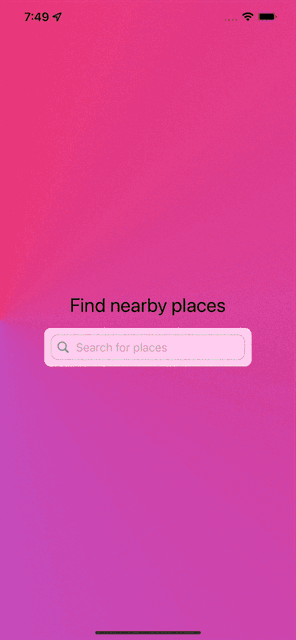

#  FindNearbyPlaces

## Summary

This app is a demonstration of the use of the FourSquare API v3 to 
show places and locations around you. It is implemented in SwiftUI 
and uses frameworks like Combine. Additionally, it uses the new
Swift 5.5 concurrency system.

## How to run

You need to create a [FourSquare API](https://foursquare.com/products/places/)
account, create an app and obtain a API key. Then replace the existing one at
FindNearbyPlaces/Network/Endpoint in the "Authorization" header at line 20.

## Snapshot

